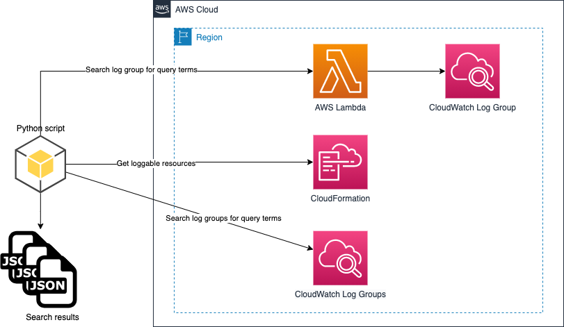
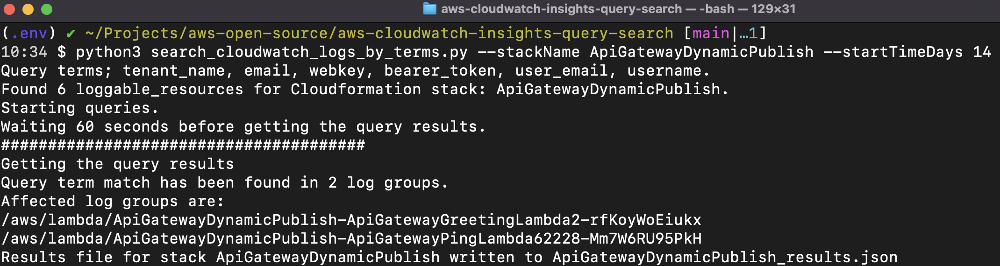

# cloudwatch-insights-query-search

Modern, distributed applications consist of multiple moving pieces that generate disparate logging information.

AWS provides the [Amazon CloudWatch](https://aws.amazon.com/cloudwatch/) monitoring and observability service which collects monitoring and operational data in the form of logs, metrics, and events. It offers a unified view of operational health and complete visibility of your AWS resources, applications, and services running on AWS and on-premises.

There are various situations in which customers need to search across multiple CloudWatch Log Groups for the presence of query terms. This could be to trace a distributed action via a correlation id or to identify the presence of PII data.

The solution presented in this project provides a script that is capable of interrogating a CloudFormation stack (or multiple CloudFormation stacks) and determining the *loggable* resources associated with the stack. The script will then proceed to search the Amazon CloudWatch Log Groups associated with the stack resources for specific query terms over a user-defined time range. The script will identify the Amazon CloudWatch Log Groups Logs which contain instances of the query term and more detailed results are written to JSON files which allow for customers to do additional processing of the data.

----

* [Solution overview](#solution-overview)
* [Executing the solution](#executing-the-solution)
* [Advanced usage](#advanced-usage)
* [Advanced usage examples](#advanced-usage-examples)

# Solution Overview

The solution architecture discussed in this post is presented below:



The core services of the solution architecture are referenced below:

| Core service | Description |
|-----------------|:-------------|
| [Amazon CloudWatch](https://aws.amazon.com/cloudwatch/) | Amazon CloudWatch is a monitoring and observability service built for DevOps engineers, developers, site reliability engineers (SREs), IT managers, and product owners. CloudWatch provides you with data and actionable insights to monitor your applications, respond to system-wide performance changes, and optimize resource utilization. CloudWatch collects monitoring and operational data in the form of logs, metrics, and events. You get a unified view of operational health and gain complete visibility of your AWS resources, applications, and services running on AWS and on-premises. The script provided by this solution can search the log data stored within Amazon CloudWatch Log Groups for specific query terms over a user defined time range. |
| [Amazon CloudWatch Insights](https://docs.aws.amazon.com/AmazonCloudWatch/latest/logs/AnalyzingLogData.html) | CloudWatch Logs Insights enables you to interactively search and analyze your log data in Amazon CloudWatch Logs. You can perform queries to help you more efficiently and effectively respond to operational issues. If an issue occurs, you can use CloudWatch Logs Insights to identify potential causes and validate deployed fixes. CloudWatch Logs Insights includes a purpose-built query language with a few simple but powerful commands. The script provided by this solution can search the log data stored within Amazon CloudWatch Log Groups for specific query terms over a user defined time range using the CloudWatch Logs Insights query language. |
| [Amazon CloudFormation](https://aws.amazon.com/cloudformation/) | CloudWatch Logs Insights enables you to interactively search and analyze your log data in Amazon CloudWatch Logs. You can perform queries to help you more efficiently and effectively respond to operational issues. If an issue occurs, you can use CloudWatch Logs Insights to identify potential causes and validate deployed fixes. CloudWatch Logs Insights includes a purpose-built query language with a few simple but powerful commands. The script provided queries CloudFormation stacks to determine the *loggable* resources that belong to that stack. A *loggable* resource is any CloudFormation resource of type `AWS::Logs::LogGroup` or `AWS::Lambda::Function` |

1. The script can query either a specific CloudFormation stack or multiple CloudFormation stacks that match a partial name match.
2. The specified CloudFormation stacks are queried to determine the *loggable* resources that belong to that stack. A *loggable* resource is any CloudFormation resource of type `AWS::Logs::LogGroup` or `AWS::Lambda::Function`. This captures all explicitly declared CloudWatch Log Groups as well as the implicit CloudWatch Log Groups that are associated with AWS Lambda Functions.
3. The script then uses CloudWatch Insights to search all of the CloudWatch Log Groups retrieved in the previous step for user specific query terms over a user defined time range.
4. If the query terms are discovered in any of the CloudWatch Log Groups searched, the name of the CloudWatch Log Group is printed to the console and detailed JSON results file are written to the file system.

# Executing the solution

The solution provides a [Python](https://www.python.org/) script.

The project assumes the following pre-requisites:

* configuration of [AWS CLI Environment Variables](https://docs.aws.amazon.com/cli/latest/userguide/cli-configure-envvars.html).
* an AWS user account with permissions to describe and list CloudFormation stacks as well as query CloudWatch LogGroups
* the availability of a `bash` (or compatible) shell environment.

A [Python Virtual Environment](https://docs.python.org/3/library/venv.html) can be created using the commands referenced below:

```bash
python3 -m venv .env
source .env/bin/activate
pip install -r requirements.txt
```

The [script](search_cloudwatch_logs_by_terms.py) will search CloudWatch LogGroups associated with a CloudFormation stack for query terms which are defined in the external file; [query_terms.yaml](query_terms.yaml).

Adjust the values in [query_terms.yaml](query_terms.yaml) to match your desired query terms.

```yaml
query-terms:
  - 'tenant_name'
  - 'email'
  - 'webkey'
  - 'bearer_token'
  - 'user_email'
  - 'username'
  - 'password'
```

With the Virtual Environment created and the query terms defined, the script can be executed as shown below. This a simple execution which will search the CloudWatch LogGroups associated with a stack named `my-awesome-stack` over a period of `7` days.

```bash
python3 search_cloudwatch_logs_by_terms.py \
    --stackName my-awesome-stack \
    --startTimeDays 7
```

An example of the resulting script execution is shown below:



The script will write verbose results to the root of the project directory in a file named as `CLOUDFORMATION_STACK_NAME`_results.json.

An example snippet from the results file is shown below where the script has detected matches for the query terms. In this specific case, log files were detected which contained the query terms; `tenant_name` and `email`.:

```json
[
  {
    "log_group_name": "/aws/lambda/ApiGatewayDynamicPublish-ApiGatewayGreetingLambda2-rfKoyWoEiukx",
    "results": [
      [
        {
          "field": "@timestamp",
          "value": "2023-01-06 09:30:23.937"
        },
        {
          "field": "@message",
          "value": "[INFO]\t2023-01-06T09:30:23.936Z\tb9fbf1be-0403-4e7a-afd3-859380fc64d0\ttenant_name: MY-TENNANT\n"
        },
        {
          "field": "@ptr",
          "value": "CpcBClwKWDU4MjAzNjkyMTI0MjovYXdzL2xhbWJkYS9BcGlHYXRld2F5RHluYW1pY1B1Ymxpc2gtQXBpR2F0ZXdheUdyZWV0aW5nTGFtYmRhMi1yZktveVdvRWl1a3gQBBI1GhgCBjnXG04AAAAAXIZAhgAGO36fcAAABuIgASiih6uz2DAwwZars9gwOBBA6h9IrypQuhgYABAMGAE="
        }
      ],
      [
        {
          "field": "@timestamp",
          "value": "2023-01-06 09:30:23.937"
        },
        {
          "field": "@message",
          "value": "[INFO]\t2023-01-06T09:30:23.936Z\tb9fbf1be-0403-4e7a-afd3-859380fc64d0\temail: somemail@domain.com\n"
        },
        {
          "field": "@ptr",
          "value": "CpcBClwKWDU4MjAzNjkyMTI0MjovYXdzL2xhbWJkYS9BcGlHYXRld2F5RHluYW1pY1B1Ymxpc2gtQXBpR2F0ZXdheUdyZWV0aW5nTGFtYmRhMi1yZktveVdvRWl1a3gQBBI1GhgCBjnXG04AAAAAXIZAhgAGO36fcAAABuIgASiih6uz2DAwwZars9gwOBBA6h9IrypQuhgYABANGAE="
        }
      ]
```

# Advanced usage

The [script](search_cloudwatch_logs_by_terms.py) provides several CLI (Command Line Interface) options to support more advanced usage of the tool.

The CLI options can be shown with the following command:

```bash
python3 search_cloudwatch_logs_by_terms.py --help
```

Output of the help command is shown below:

```bash
usage: search_cloudwatch_logs_by_terms.py [-h] [--partialStackName PARTIALSTACKNAME] [--stackName STACKNAME] [--queryWait QUERYWAIT]
                                          [--queryLimit QUERYLIMIT] [--startTimeMins STARTTIMEMINS] [--startTimeHours STARTTIMEHOURS]
                                          [--startTimeDays STARTTIMEDAYS] [--endTime ENDTIME]

Check a CloudFormation stacks CloudWatch logs for query terms.

optional arguments:
  -h, --help            show this help message and exit
  --partialStackName PARTIALSTACKNAME
                        CloudFormation stacks which include the partial name
  --stackName STACKNAME
                        the CloudFormation stack name
  --queryWait QUERYWAIT
                        how many seconds to wait for the queries to complete
  --queryLimit QUERYLIMIT
                        the number of results to return per query
  --startTimeMins STARTTIMEMINS
                        the start time, in minutes, for which the logs are to queried
  --startTimeHours STARTTIMEHOURS
                        the start time, in hours, for which the logs are to queried
  --startTimeDays STARTTIMEDAYS
                        the start time, in days, for which the logs are to queried
  --endTime ENDTIME     the end time for which the logs are to queried.
  ```

# Advanced usage examples

The following code snippets show various usages of the CLI.

*Search the last 14 days of logs against multiple CloudFormation stacks that match a partial name*

```bash
python3 search_cloudwatch_logs_by_terms.py \
    --partialStackName my-app \
    --startTimeDays 14
```

*Search the last 6 hours of logs for a specific CloudFormation stacks name*

```bash
python3 search_cloudwatch_logs_by_terms.py \
    --stackName my-awesome-stack \
    --startTimeHours 6
```

*Perform a historical query between 01/01/2022 and 14/01/2022 against a specific CloudFormation stack name*

```bash
python3 search_cloudwatch_logs_by_terms.py \
    --stackName my-awesome-stack \
    --startTimeDays 14
    --endTime 1642118400 # unix epoch representing 01/01/2022 00:00:00
```